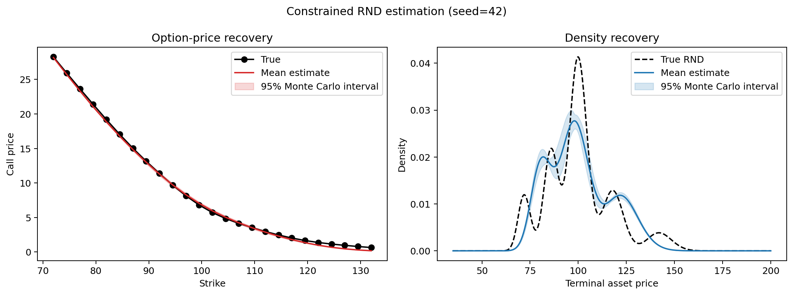

# Risk-Neutral Density Estimation

[](https://github.com/qiuqiuqiu12277/Risk-Neutral-Density-Estimation/actions/workflows/ci.yml)

An arbitrage-aware research toolkit for recovering the market-implied distribution of a future
asset price from a cross-section of European call options. The estimator uses a flexible
lognormal mixture, analytic option prices, and constrained optimisation.

The project is designed around one principle: a visually plausible curve is not enough. Every
estimated density must be a valid probability distribution and must satisfy the risk-neutral
martingale condition.

## What is implemented

- Normalized nonparametric lognormal-mixture densities
- Analytic European call pricing for every mixture component
- Non-negative mixture weights and a probability-mass constraint
- Exact risk-neutral forward constraint, `E_Q[S_T] = S_0 exp((r-q)T)`
- Smoothness-regularized constrained calibration with explicit failure reporting
- Call-price bound, monotonicity, and convexity diagnostics
- Density moments: mean, variance, standard deviation, skewness, and kurtosis
- Reproducible Monte Carlo experiments with pointwise 95% intervals
- Validated offline CSV input using either prices or bid/ask quotes
- JSON/CSV reports, diagnostic figures, a CLI, tests, linting, and CI



## Model

The risk-neutral density is represented as

```text
f_Q(s) = sum_j w_j LogNormal(s | mu_j, tau),   w_j >= 0,   sum_j w_j = 1.
```

For each component, the call expectation has a closed form. Calibration therefore avoids
finite-difference densities and truncated numerical payoff integrals. The weights minimize
option-pricing error plus a second-difference smoothness penalty, subject to

```text
sum_j w_j exp(mu_j + tau^2 / 2) = S_0 exp((r-q)T).
```

`annual_volatility` and the terminal log standard deviation `tau` are deliberately kept as
different quantities: `tau = annual_volatility * sqrt(T)`.

## Quick start

```bash
git clone https://github.com/qiuqiuqiu12277/Risk-Neutral-Density-Estimation.git
cd Risk-Neutral-Density-Estimation
python -m venv .venv
source .venv/bin/activate
python -m pip install -e ".[dev]"
```

Run a deterministic validation study:

```bash
rnd-estimate simulate --runs 100 --seed 42 --output-dir artifacts/simulation
```

Fit the included synthetic option chain without a network connection:

```bash
rnd-estimate fit \
  --input data/sample_option_chain.csv \
  --spot 100 \
  --maturity 0.25 \
  --rate 0.03 \
  --dividend-yield 0.01 \
  --annual-volatility 0.22 \
  --output-dir artifacts/sample-fit
```

Both commands can also be invoked as `python -m rnd_estimator ...`. Use `--no-plot` in
headless jobs.

## Input format

The CSV loader accepts one of these schemas:

```csv
strike,call_price
90,11.28
```

or

```csv
strike,bid,ask
90,11.23,11.33
```

Bid/ask quotes are converted to mid-prices. Invalid quotes fail loudly, and duplicate strikes
are consolidated by their median price. The bundled file in `data/` is synthetic and contains
no proprietary market data.

## Outputs

Simulation mode writes:

- `summary.json` — configuration, calibration success count, RMSE, and interval coverage
- `price_results.csv` — true, estimated, and interval call prices by strike
- `simulation_diagnostics.png` — price and density recovery

Fit mode writes:

- `fit_summary.json` — weights, moments, errors, forward residual, and input arbitrage checks
- `fitted_prices.csv` — observed values, fitted values, and residuals
- `fit_diagnostics.png` — call fit and estimated density

## Project layout

```text
.
├── data/
│   └── sample_option_chain.csv
├── src/rnd_estimator/
│   ├── black_scholes.py
│   ├── calibration.py
│   ├── cli.py
│   ├── data.py
│   ├── diagnostics.py
│   ├── distributions.py
│   ├── pricing.py
│   ├── reporting.py
│   └── simulation.py
├── tests/
├── figures/
├── references/
├── pyproject.toml
└── README.md
```

## Verification

```bash
pytest --cov=rnd_estimator --cov-report=term-missing
ruff check .
rnd-estimate simulate --runs 10 --seed 42 --no-plot
```

The test suite checks, among other things:

- probability mass equals one;
- the terminal-price mean equals the forward;
- analytic mixture prices match Black--Scholes in the one-component case;
- fitted weights are non-negative and sum to one;
- model prices satisfy static call-option no-arbitrage conditions;
- identical seeds produce identical reports;
- the complete CSV-to-report workflow runs offline.

## Interpretation and limitations

The output is a **risk-neutral** distribution inferred from option prices, not a forecast of the
physical real-world return distribution. Results remain sensitive to quote quality, maturity
selection, rate/dividend assumptions, component width, and regularization. Bid/ask cleaning and
cross-maturity surface construction should be added before using the estimator on production
market feeds.

Historical analysis requires historical option-chain snapshots matched to the spot and date.
The project intentionally does not combine historical spot prices with a current option chain.

## References

- Breeden, D. T. and Litzenberger, R. H. (1978), *Prices of State-Contingent Claims Implicit in
  Option Prices*.
- Yuan, M. (2009), *State Price Density Estimation via Nonparametric Mixtures*.
